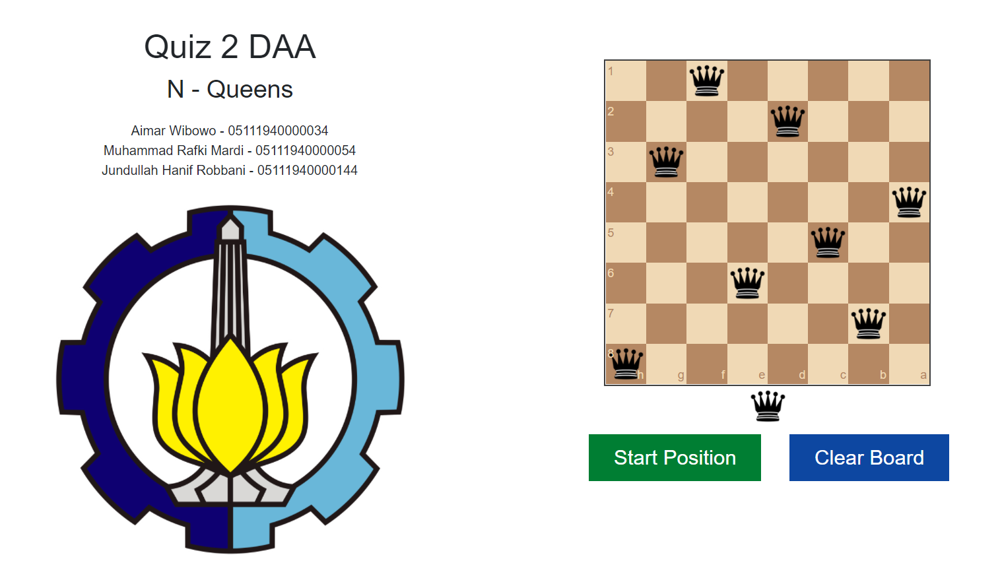
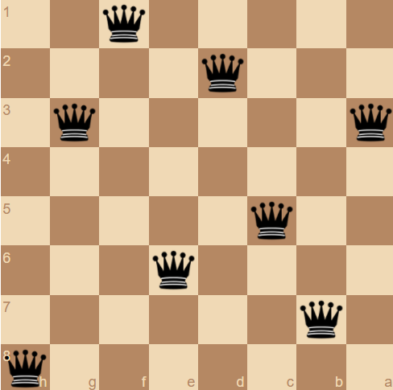
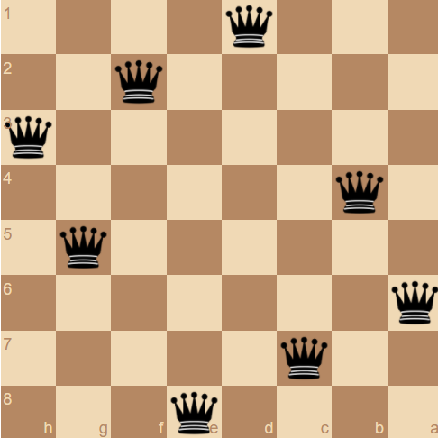

<h1 align="center">N Queens - DFS</h1>

## Demo App

The end product of this group project is deployed to Vercel at the link below. Please check it out and enjoy!

http://nqueen-daa-quiz-2-its.vercel.app/

## Screenshot App

<h3>Sample Input</h3>

<h3>Sample Output</h3>

## Contributors

This project was completed as a collaboration between:

- **Aimar Wibowo** - 05111940000034
- **Muhammad Rafki Mardi** - 05111940000054
- **Jundullah Hanif Robbani** - 05111940000144

## Disclaimer

This project was created to fulfill Quiz 2 assignment for Design and Analysis Algorithm course.

## Overview

The N-Queens problem is a problem of placing N queen pieces in a chessboard size N x N so that no queens overlap each other attack, i.e. no two queen pieces are lies in one row, one column, and one the same diagonal. In this project, we modified the problem a little bit. The number of queens can be 1-8, the user can place the first queens anywhere on the chessboard, while the chessboard's size is locked at 8x8. We use depth-first search (DFS) algorithm to find solutions to the N-Queens problem. The algorithm starts by moving the first queens, and then recursively moving the next queen, until all queen is in any of the safe places. If no safe place is left, then we backtrack to move the position of the placed queen.

## Technologies

The technologies used to complete this project were:

- **HTML5** - front-end layout
- **CSS3** - front-end styling
- **Bootstrap** - front-end framework
- **JavaScript** - front-end and logic
- **Github** - code repository and issue tracking
